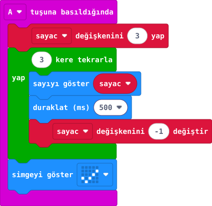

## Önce tahmin et

:::tahmin
A’ya ikinci kez basınca ilk görünen sayı yine kaç olur?
:::

::yaz[Tahminim]{satir=1}

## Yap

1. Yeni projede **sayac** değişkenini oluştur; **“A tuşuna basıldığında”** bloğunu ekle.
2. A bloğunun başına **“sayac değişkenini 3 yap”** koy.
3. Altına **Döngüler** bölümünden **“3 kere tekrarla”** bloğunu ekle.
4. Tekrarın içine sırayla **“sayıyı göster sayac”**, **“duraklat (ms) 500”**, **“sayac değişkenini -1 değiştir”** koy.
5. Tekrar bloğunun altına **“onay simgesini göster”** ekle. Simülatörde A’ya bas; 3, 2, 1 ve ardından işareti izle.

## Kartında dene

Kodu karta aktar. A’ya bas ve sayıların sırasını oku. Sonra tekrar bas.

::sira[3 → 2 → 1 → ✓]

:::olmadiysa
**3 yap** tekrarın üstünde, göster–bekle–azalt blokları içinde, onay simgesi ise tekrarın altında mı?
:::

## Anlat

::yaz[**Gözlemim:** İlk basışta sıra: \_\_\_, \_\_\_, \_\_\_.]{satir=2}

::yaz[**Neden?** İkinci basış neden yeniden 3 ile başladı?]{satir=2}

## Tek şeyi değiştir

Beklemeyi **1000 ms** yap. Geri sayımın hızı nasıl değişti?

::yaz[Ne değişti?]{satir=2}
