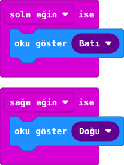

## Önce tahmin et

:::tahmin
Kartı önce sola, sonra sağa eğersen ekranda en son hangi ok kalır?
:::

::yaz[Tahminim]{satir=1}

## Yap

1. Yeni projede **Giriş** bölümünden iki hareket olayı al: **“sola eğin ise”** ve **“sağa eğin ise”**.
2. Sola eğilme bloğuna **“Batı oku göster”** ekle; bu ok sola bakar.
3. Sağa eğilme bloğuna **“Doğu oku göster”** ekle; bu ok sağa bakar.
4. Simülatörde kartı fareyle sola ve sağa yatır; okları gözle.

## Kartında dene

Kodu karta aktar. Kartı iki elinle tutup yavaşça sola, sonra sağa eğ.

::sira[sola ← → sağa]

:::olmadiysa
Kartı düz konumdan başlayarak belirgin biçimde yana eğ; iki olayın ok yönlerini kontrol et.
:::

## Anlat

::yaz[**Gözlemim:** Sağa eğince ok \_\_\_\_\_\_\_\_\_\_ yönüne baktı.]{satir=2}

::yaz[**Neden?** Düğmeye basmadan kodu hangi hareket başlattı?]{satir=2}

## Tek şeyi değiştir

Sağa eğilmedeki oku yukarı okla değiştir. Sol oka ne oldu?

::yaz[Ne değişti?]{satir=2}
