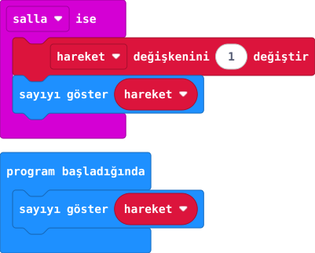

## Önce tahmin et

:::tahmin
Kartı beş kez kısa ve hızlı salladığında ekranda tam beş görür müsün?
:::

::yaz[Tahminim]{satir=1}

## Yap

1. Yeni projede **hareket** değişkenini oluştur. **“program başladığında”** alanında **“sayıyı göster hareket”** bloğunu kullan.
2. **Giriş** bölümünden **“salla ise”** olayını ekle.
3. İçine sırayla **“hareket değişkenini 1 değiştir”** ve **“sayıyı göster hareket”** koy.
4. Simülatörde **salla** düğmesine beş kez bas; sayıyı izle.

## Kartında dene

Kodu karta aktar. USB kablosunu germeden kartı masanın yakınında beş kez kısa ve hızlı biçimde ileri geri salla.

::sira[1 → 2 → 3 …]

:::olmadiysa
**“salla ise”** içinde önce sayıyı artırıp sonra **hareket** değişkenini gösterdiğini kontrol et.
:::

## Anlat

::yaz[**Gözlemim:** Beş sallamada ekranda \_\_\_\_\_\_ gördüm.]{satir=2}

::yaz[**Neden?** Bu sayı neden kesin adım sayısı değildir?]{satir=2}

## Tek şeyi değiştir

**1 değiştir** değerini **2** yap. Sayılar nasıl ilerledi?

::yaz[Ne değişti?]{satir=2}
