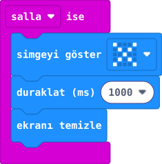

## Önce tahmin et

:::tahmin
Bir kez sallayıp beklersen uyarı ekranda kalır mı?
:::

::yaz[Tahminim]{satir=1}

## Yap

1. Yeni projeye **“salla ise”** bloğunu ekle.
2. İçine **“simgeyi göster”** bloğu koy ve **çarpı** işaretini seç.
3. Altına **“duraklat (ms) 1000”** ve **“ekranı temizle”** bloklarını sırayla ekle.
4. Simülatörde kartı salla; uyarıdan sonra ekrana bak.

## Kartında dene

Kodu karta aktar. Kartı USB kablosunu germeden kısa ve hızlı biçimde salla; bir süre bekle.

::jest[Uyarı → boş ekran]{tuslar="×"}

:::olmadiysa
**“ekranı temizle”** bloğu bekleme bloğunun altında mı?
:::

## Anlat

::yaz[**Gözlemim:** Uyarıdan sonra ekran \_\_\_\_\_\_\_\_\_\_.]{satir=2}

::yaz[**Neden?** Uyarıyı hangi olay başlattı?]{satir=2}

## Tek şeyi değiştir

Beklemeyi **3000 ms** yap. Uyarı daha uzun mu görünür?

::yaz[Ne değişti?]{satir=2}
