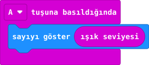

## Önce tahmin et

:::tahmin
LED ekranı elinle gölgelersen sayı artar mı, azalır mı?
:::

::yaz[Tahminim]{satir=1}

## Yap

1. Yeni projede **“A tuşuna basıldığında”** bloğunu ekle.
2. İçine **“sayıyı göster”** koy. Sayı alanına **Giriş** bölümündeki **“ışık seviyesi”** bloğunu tak.
3. Simülatörde ışık kaydırıcısını değiştirip A’ya bas. İki sonucu karşılaştır.
4. Kartta ilk okumada **0** görürsen ışık algısı açıldıktan sonra A’ya yeniden bas.

## Kartında dene

Kodu karta aktar. Aydınlıkta A’ya bas; sayıyı yaz. Ekranı elinle gölgele ve yeniden bas.

::yaz[Aydınlık]{satir=1}

::yaz[Gölgede]{satir=1}

:::olmadiysa
**“ışık seviyesi”** bloğu **“sayıyı göster”** alanının içinde mi? İlk 0’dan sonra tekrar ölç.
:::

## Anlat

::yaz[**Gözlemim:** Gölgede sayı \_\_\_\_\_\_\_\_\_\_.]{satir=2}

::yaz[**Neden?** Sayı hangi değişikliği anlatıyor?]{satir=2}

## Tek şeyi değiştir

Kodu değiştirmeden el fenerini ekrana yaklaştır. En yüksek okuduğun değer kaç?

::yaz[Ne değişti?]{satir=2}
