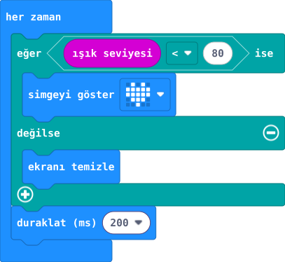

## Önce tahmin et

:::tahmin
Ortam yeniden aydınlanınca yıldız ekranda kalır mı?
:::

::yaz[Tahminim]{satir=1}

## Yap

1. Yeni projede hazır gelen **“her zaman”** bloğuna **“eğer / değilse”** yapısını ekle.
2. Koşulu **“ışık seviyesi \< 80”** yap. **80**, bu projenin deneme sınırıdır.
3. **Eğer** bölümüne yıldızlı **“simgeyi göster”**; **değilse** bölümüne **“ekranı temizle”** koy.
4. Yapının altına **“duraklat (ms) 200”** ekle. Simülatörde ışığı azaltıp artır.

## Kartında dene

Kodu karta aktar. LED ekranını elinle gölgele, sonra yeniden aydınlat.

::jest[Gölge → yıldız]{tuslar="★"}

:::olmadiysa
Işığı ölç projesindeki değeri hatırla. Ortamına göre eşik **80** çok düşük olabilir. İlk okuma 0 ise açılışta yıldız kısa süre görünebilir.
:::

## Anlat

::yaz[**Gözlemim:** Yıldız \_\_\_\_\_\_\_\_\_\_ durumda göründü.]{satir=2}

::yaz[**Neden?** Işık 80’in üstüne çıkınca hangi bölüm çalışır?]{satir=2}

## Tek şeyi değiştir

Eşiği **80** yerine **140** yap. Yıldız ne zaman görünüyor?

::yaz[Ne değişti?]{satir=2}
