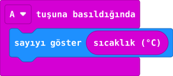

## Önce tahmin et

:::tahmin
Art arda iki kez ölçersen aynı sayıyı görmek zorunda mısın?
:::

::yaz[Tahminim]{satir=1}

## Yap

1. Yeni projeye **“A tuşuna basıldığında”** bloğunu ekle.
2. İçine **“sayıyı göster”** koy. Sayı alanına **Giriş** bölümündeki **“sıcaklık (°C)”** bloğunu tak.
3. Simülatörde A’ya bas. Sonucu not et; bir süre sonra yeniden ölç.

## Kartında dene

Kodu karta aktar. A’ya basıp değeri yaz; kısa bir süre sonra yeniden oku.

::yaz[İlk okuma]{satir=1}

::yaz[İkinci]{satir=1}

:::bilgi
**Önemli:** Bu, oda havasının kesin sıcaklığı değildir. Kartın içindeki çipten yaklaşık değer elde edilir.
:::

## Anlat

::yaz[**Gözlemim:** İki okumam: \_\_\_\_\_\_ °C ve \_\_\_\_\_\_ °C.]{satir=2}

::yaz[**Neden?** Bu değer neden oda termometresiyle eşit olmak zorunda değil?]{satir=2}

## Tek şeyi değiştir

Kartı elinde bir dakika tut; aynı kodla yeniden ölç. Çip sıcaklığı değişti mi?

::yaz[Ne değişti?]{satir=2}
