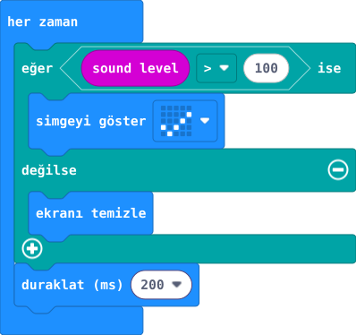

## Önce tahmin et

:::tahmin
Ses kesilince işaret ekranda kalır mı?
:::

::yaz[Tahminim]{satir=1}

## Yap

1. Önce kısa bir ölçüm yap: **A tuşuna basıldığında → sayıyı göster (sound level)** kur. Sessiz sınıfta ve bir alkışta gördüğün sayıları not et. Sonra bu deneme bloklarını sil.
2. Yeni projede **“her zaman”** bloğuna **“eğer / değilse”** ekle.
3. **Giriş** bölümündeki **“sound level”** (ses düzeyi) bloğuyla koşulu **“sound level \> 100”** yap. **100** deneme eşiğidir; ölçtüğün sessiz ve alkış değerlerinin arasındaysa kullan, değilse arada bir sayı seç. Ses kaydedilmez.
4. **Eğer** bölümüne onay işaretli **“simgeyi göster”**, **değilse** bölümüne **“ekranı temizle”** koy.
5. Alta **“duraklat (ms) 200”** ekle. Simülatörde mikrofon düzeyini değiştir.

## Kartında dene

Kodu karta aktar. Kartın yakınında bir kez normalce alkışla; sonra ortam sessizleşsin.

::jest[Ses → işaret]{tuslar="✓"}

:::olmadiysa
Simülatörde ses düzeyini artır. Kartta işaret çıkmıyorsa **100** eşiği ortam için yüksek olabilir.
:::

## Anlat

::yaz[**Gözlemim:** İşaret \_\_\_\_\_\_\_\_\_\_ olduğunda göründü.]{satir=2}

::yaz[**Neden?** Ses azalınca hangi bölüm ekranı temizliyor?]{satir=2}

## Tek şeyi değiştir

Eşiği **100** yerine **150** yap. İşaretin görünmesi nasıl değişti?

::yaz[Ne değişti?]{satir=2}
