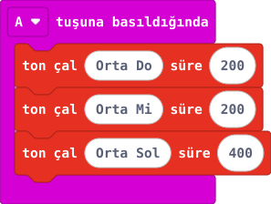

## Önce tahmin et

:::tahmin
Üç sesin inceliği aynı mı olacak?
:::

::yaz[Tahminim]{satir=1}

## Yap

1. Yeni projeye **“A tuşuna basıldığında”** bloğunu ekle.
2. **Müzik** bölümünden üç **“ton çal süre”** bloğunu olayın içine sırayla yerleştir.
3. Tonları **Orta Do**, **Orta Mi**, **Orta Sol**; süreleri sırasıyla **200**, **200**, **400 ms** yap.
4. Simülatörde A’ya basıp sesleri dinle.

## Kartında dene

Kodu karta aktar. A’ya bir kez basıp V2 hoparlörünü dinle.

::jest[Üç kısa ses]{tuslar="♪"}

:::olmadiysa
Kartın V2 olduğunu ve ses düzeyini kontrol et. Bazı tarayıcılarda simülatör sesi açılmayabilir.
:::

## Anlat

::yaz[**Gözlemim:** Duyduğum sesler gittikçe \_\_\_\_\_\_\_\_\_\_.]{satir=2}

::yaz[**Neden?** Son ses neden ötekilerden uzun sürüyor?]{satir=2}

## Tek şeyi değiştir

Son sesin süresini **400** yerine **800 ms** yap. Ne değişti?

::yaz[Ne değişti?]{satir=2}
