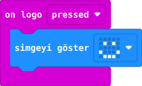

## Önce tahmin et

:::tahmin
Yalnız A düğmesine basarsan mutlu yüz çıkar mı?
:::

::yaz[Tahminim]{satir=1}

## Yap

1. Yeni projede **Giriş** bölümünden **“on logo pressed”** (logoya dokunulduğunda) olay bloğunu bul.
2. Olayın içine **“simgeyi göster”** bloğunu koy; **mutlu yüz** simgesini seç.
3. Simülatörde logoya dokun. Ardından A düğmesini de dene.

## Kartında dene

Kodu karta aktar. Kartın önündeki altın renkli logoya parmağınla hafifçe dokun.

::jest[Dokun → yüz]{tuslar="☺"}

:::olmadiysa
A düğmesine değil, üstteki logoya dokunduğundan emin ol. Bu özellik V2 karttadır.
:::

## Anlat

::yaz[**Gözlemim:** Mutlu yüz \_\_\_\_\_\_\_\_\_\_ dokununca göründü.]{satir=2}

::yaz[**Neden?** A düğmesine basmak neden bu kodu başlatmadı?]{satir=2}

## Tek şeyi değiştir

Mutlu yüz yerine **kalp** simgesini seç. Kartı yine nasıl başlattın?

::yaz[Ne değişti?]{satir=2}
