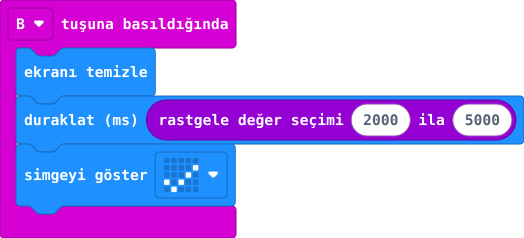
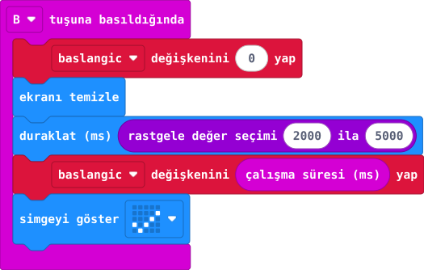
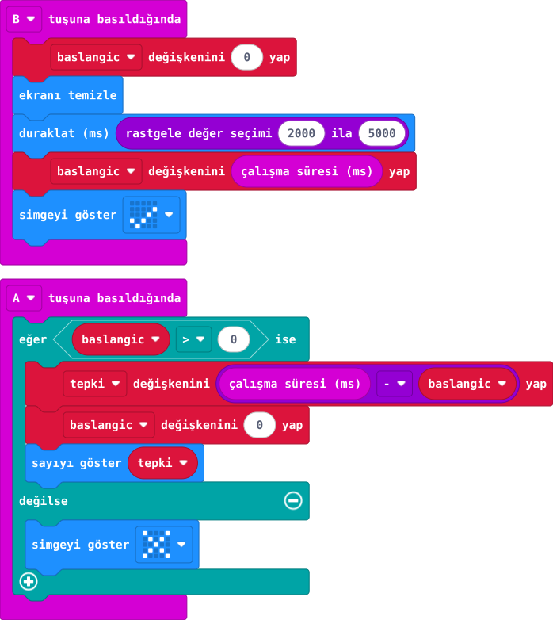

## 1. kısım — İşareti bekle

B’ye basınca kart, değişen bir sürenin ardından işareti göstersin.

::kunye{sure="10" fikir="rastgele bekleme" malzeme="micro:bit V2 + veri USB kablosu"}

### Önce tahmin et

:::tahmin
B’ye her basışta işaret aynı anda mı çıkacak?
:::

::yaz[Tahminim]{satir=1}

### Yap

1. Yeni projeye **“B tuşuna basıldığında”** bloğunu ekle.
2. İçine sırayla **“ekranı temizle”**, **“duraklat (ms)”** ve onay işaretli **“simgeyi göster”** bloklarını koy.
3. Duraklat bloğunun sayı alanına **“rastgele değer seçimi 2000 ila 5000”** bloğunu tak. Bu, yaklaşık **2–5 saniye** bekletir.
4. Simülatörde B’ye bir kez bas; işaret görünene kadar bekle.

### Kartında dene

Kodu karta aktar. B’ye bir kez bas; işareti bekle. Aynı denemeyi iki kez daha yap.

::jest[Bekle → ✓]{tuslar="B"}

:::olmadiysa
B’ye bir kez bastıktan sonra en az 5 saniye bekle. Hemen yeniden basma.
:::

### Anlat

::yaz[**Gözlemim:** İşaret her denemede \_\_\_\_\_\_\_\_\_\_ zamanda çıktı.]{satir=2}

::yaz[**Neden?** Bekleme süresini hangi blok değiştiriyor?]{satir=2}

### Tek şeyi değiştir

**2000** yerine **1000** yaz. En kısa bekleme nasıl değişti? Sonra 2000’e dön.

::yaz[Ne değişti?]{satir=2}

## 2. kısım — Başlangıç anını sakla

İşaret çıktığı anda kartın çalışma süresini kaydet.

::kunye{sure="10" fikir="zamanı değişkende saklama" malzeme="micro:bit V2 + veri USB kablosu"}

### Önce tahmin et

:::tahmin
Başlangıç anı B’ye basınca mı, işaret görünürken mi kaydedilmeli?
:::

::yaz[Tahminim]{satir=1}

### Önceki kodu geliştir

1. **baslangic** adlı değişkeni oluştur. B olayının başında onu **0** yap.
2. Rastgele bekleme bloğundan sonra **“baslangic değişkenini çalışma süresi (ms) yap”** bloğunu koy.
3. Onay işaretli **“simgeyi göster”** bloğu en sonda kalsın. Kodu simülatörde çalıştır.

### Kartında dene

Kodu karta aktar. B’ye basıp işareti bekle. Bu aşamada sayı görünmez; kart yalnız başlangıç anını saklar.

::jest[Bekle → ✓]{tuslar="B"}

:::bilgi
**Hatırla:** **1000 ms = 1 saniye.** “Çalışma süresi” program başladığından beri geçen süredir.
:::

### Anlat

::yaz[**Gözlemim:** İşaret \_\_\_\_\_\_\_\_\_\_ sonra göründü.]{satir=2}

::yaz[**Neden?** **baslangic** neden beklemeden sonra yazılıyor?]{satir=2}

### Tek şeyi değiştir

İşaret yerine **kalp** göster. Kaydedilen an değişir mi? Sonra işarete dön.

::yaz[Ne değişti?]{satir=2}

## 3. kısım — Ne kadar hızlıydın?

İşaretten sonra A’ya bas; kart iki anın farkını milisaniye olarak göstersin.

::kunye{sure="15" fikir="iki anın farkı" malzeme="micro:bit V2 + veri USB kablosu"}

### Önce tahmin et

:::tahmin
İşaret çıkmadan A’ya basarsan süre görünür mü?
:::

::yaz[Tahminim]{satir=1}

### Önceki kodu tamamla

1. **“A tuşuna basıldığında”** olayına **“eğer baslangic \> 0 ise / değilse”** koşulunu koy. **Değilse** bölümünde çarpı göster: işaretten önceki basış geçersizdir.
2. İçeride **tepki** değişkenini **“çalışma süresi (ms) − baslangic”** yap.
3. **baslangic** değerini **0** yap; ardından **tepki** sayısını göster.

### Anlat

::yaz[**Gözlemim:** İki denemem: \_\_\_\_\_\_ ms ve \_\_\_\_\_\_ ms.]{satir=2}

::yaz[**Neden?** İşaretten önce A’ya basınca neden çarpı çıktı?]{satir=2}

### Tek şeyi değiştir

En uzun beklemeyi **5000** yerine **3000 ms** yap. İşaret daha erken gelebilir mi?

::yaz[Ne değişti?]{satir=2}
