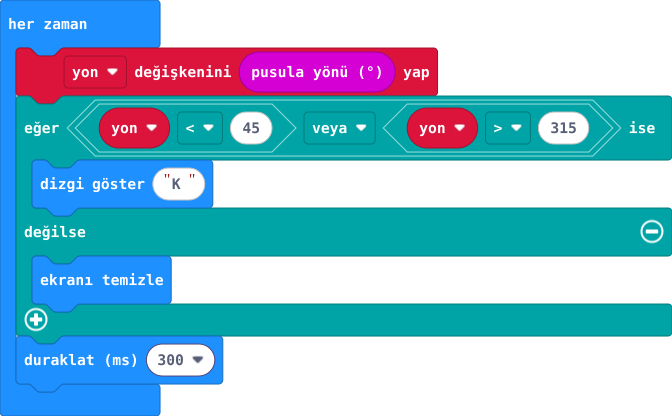

## Önce tahmin et

:::tahmin
Kartı döndürünce K hep görünür mü?
:::

::yaz[Tahminim]{satir=1}

## Yap

1. Pusulayı ilk kullanımda ekrandaki kalibrasyon noktalarını kartı eğerek tamamla.
2. Her zaman döngüsünde pusula yönünü oku. 45° altı veya 315° üstünde K göster.
3. Kartı yatay tutup yavaşça döndür; metal eşyalardan uzaklaş.

## Kartında dene

Kuzeye yakınken K görünür.

:::olmadiysa
İlk kullanım kalibrasyonunu tamamla; kartı metal eşyalardan uzaklaştırıp yatay tut.
:::

## Anlat

::yaz[**Gözlemim:** K hangi yönde göründü?]{satir=2}

::yaz[**Neden?** Neden iki açı aralığı K gösterir?]{satir=2}

## Tek şeyi değiştir

İki kuzey sınırını birlikte daralt: 45° yerine 30°, 315° yerine 330° yaz. K daha kısa bir dönüş aralığında mı görünüyor?

::yaz[Ne değişti?]{satir=2}
