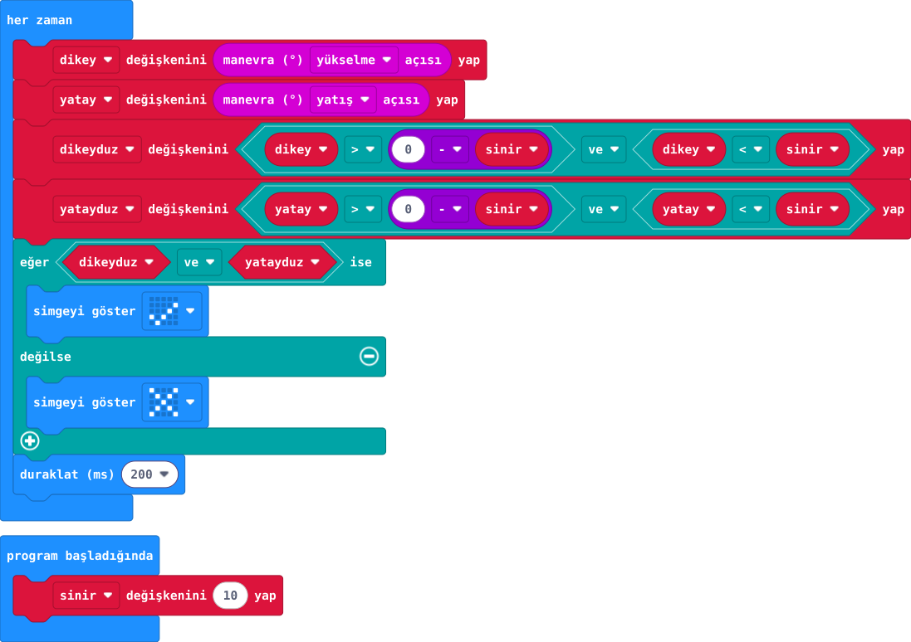

## Önce tahmin et

:::tahmin
Kart yalnız sağa eğilirse onay kalır mı?
:::

::yaz[Tahminim]{satir=1}

## Yap

1. Başlangıçta **sinir** değişkenini 10 yap. Her zaman döngüsünde öne/arkaya eğimi **dikey**, sağa/sola eğimi **yatay** değişkenine yaz.
2. İki eksende de **−sinir** ile **sinir** aralığını denetle; sonuçları **dikeyduz** ve **yatayduz** adlı doğru/yanlış değişkenlerinde sakla.
3. İkisi de doğruysa onay, değilse çarpı göster. Kartı düz ve eğik konumlarda dene.

## Kartında dene

Düzken onay, eğikken çarpı beklenir.

:::olmadiysa
Kartı masaya düz koy; iki eğim eksenini ve karşılaştırma sınırlarını kontrol et.
:::

## Anlat

::yaz[**Gözlemim:** Hangi eğimde işaret değişti?]{satir=2}

::yaz[**Neden?** Neden iki ölçüm birlikte kontrol edilir?]{satir=2}

## Tek şeyi değiştir

Yalnız sinir değişkenini 10 yerine 20 yap. Onay alanı büyüyor mu?

::yaz[Ne değişti?]{satir=2}
