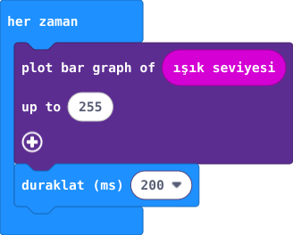

## Önce tahmin et

:::tahmin
LED yüzünü elinle gölgeleyince grafik küçülür mü?
:::

::yaz[Tahminim]{satir=1}

## Yap

1. Her zaman döngüsüne ışık düzeyi değerini koy.
2. LED bölümündeki çubuk grafik bloğunda en yüksek değeri 255 yap.
3. Kartı iki farklı ışık konumunda dene.

## Kartında dene

Aydınlıkta daha yüksek grafik beklenir.

:::olmadiysa
Kartın LED yüzünü aydınlatıp karart; grafiğin 0–255 ışık değerini kullandığını kontrol et.
:::

## Anlat

::yaz[**Gözlemim:** İki yerde grafiği çiz.]{satir=2}

::yaz[**Neden?** 255 neyi belirler?]{satir=2}

## Tek şeyi değiştir

Grafik bloğundaki en yüksek değeri 255 yerine 128 yap. Aynı ışıkta sütun değişiyor mu?

::yaz[Ne değişti?]{satir=2}
