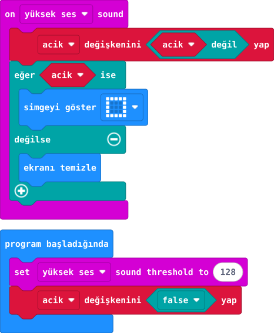

## Önce tahmin et

:::tahmin
İkinci alkıştan sonra ne olur?
:::

::yaz[Tahminim]{satir=1}

## Yap

1. **acik** adlı doğru/yanlış değişkenini oluştur; başlangıçta **yanlış** yap.
2. Başlangıçta yüksek ses eşiğini **128** yap. Bu, deneme değeridir.
3. **Yüksek ses** olayında **acik değişkenini “değil acik” yap**: doğruysa yanlış, yanlışsa doğru olur.
4. **acik** doğruysa simge göster; değilse ekranı temizle. İki ayrı alkışla dene.

## Kartında dene

Ayrı iki alkışta ekran önce yanar sonra söner.

:::olmadiysa
V2 mikrofonunu ve yüksek ses olayını kontrol et; iki alkış arasında kısa süre bırak.
:::

## Anlat

::yaz[**Gözlemim:** İki alkıştan sonra ne kaldı?]{satir=2}

::yaz[**Neden?** Değişken önceki durumu nasıl saklar?]{satir=2}

## Tek şeyi değiştir

Ses eşiğini 160 yap.

::yaz[Ne değişti?]{satir=2}
