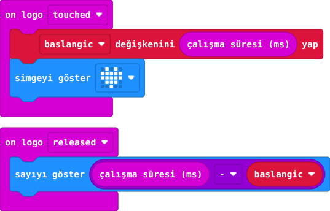

## Önce tahmin et

:::tahmin
Uzun dokunmada sonuç büyür mü?
:::

::yaz[Tahminim]{satir=1}

## Yap

1. **on logo touched** (dokunuldu) olayında çalışma süresini **baslangic** değişkenine kaydet.
2. **on logo released** (bırakıldı) olayında yeni zamandan **baslangic** değerini çıkar.
3. Farkı **milisaniye** olarak göster. 1000 ms yaklaşık 1 saniyedir.

## Kartında dene

Kısa ve uzun iki dokunmayı karşılaştır.

:::olmadiysa
Parmağını logodan tamamen kaldır; dokunma ve bırakma olaylarının ikisini de ekle.
:::

## Anlat

::yaz[**Gözlemim:** Kısa \_\_\_\_ ms; uzun \_\_\_\_ ms.]{satir=2}

::yaz[**Neden?** Neden iki zamanı çıkarıyoruz?]{satir=2}

## Tek şeyi değiştir

İkinci dokunmayı yaklaşık 1 saniye uzat. Görünen sayı yaklaşık kaç ms arttı?

::yaz[Ne değişti?]{satir=2}
