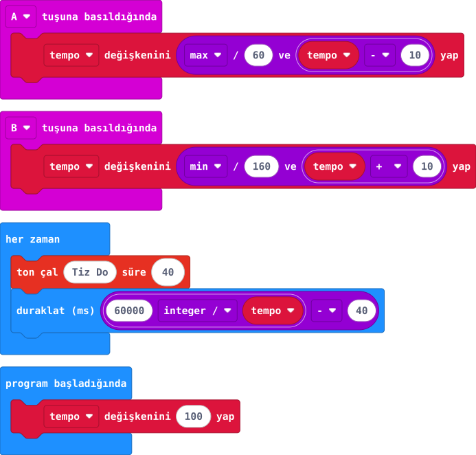

## Önce tahmin et

:::tahmin
B'ye basınca ritim hızlanır mı?
:::

::yaz[Tahminim]{satir=1}

## Yap

1. **tempo** değişkenini 100 olarak başlat.
2. A olayında 10 azaltıp 60'ın altına düşürme; B olayında 10 artırıp 160'ı geçirme.
3. Her zaman döngüsünde 40 ms ses çal. Bir vuruşun süresi **60.000 ÷ tempo** ms'dir; sesin 40 ms'sini çıkarıp kalanı bekle.

## Kartında dene

A ile yavaşlayan, B ile hızlanan tıklar duy.

:::olmadiysa
V2 hoparlörünün açık olduğunu ve tempo değişkeninin sınırlar içinde kaldığını kontrol et.
:::

## Anlat

::yaz[**Gözlemim:** Seçtiğim tempo \_\_\_\_.]{satir=2}

::yaz[**Neden?** Tempo artınca bekleme niçin azalır?]{satir=2}

## Tek şeyi değiştir

Başlangıç temposunu 80 yap.

::yaz[Ne değişti?]{satir=2}
