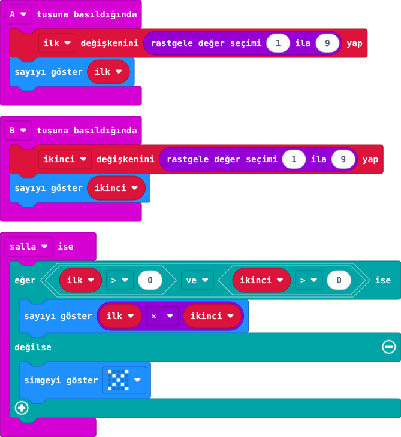

## Önce tahmin et

:::tahmin
3 ve 4 çıkarsa hangi sonuç görünür?
:::

::yaz[Tahminim]{satir=1}

## Yap

1. A ve B ile ayrı ayrı 1–9 arasında rastgele sayı seç.
2. Önce sonucu zihninden tahmin et.
3. Kartı salla ve iki sayının çarpımını gör.

## Kartında dene

Arkadaşın tahmin etsin; kartla kontrol edin.

:::olmadiysa
Önce A ve B ile iki sayı seç; çarpımı gösteren **salla ise** bloğunu ve içindeki **ilk × ikinci** işlemini kontrol et.
:::

## Anlat

::yaz[**Gözlemim:** Sayılar \_\_\_\_ ve \_\_\_\_; sonuç \_\_\_\_.]{satir=2}

::yaz[**Neden?** Hangi blok çarpma yapıyor?]{satir=2}

## Tek şeyi değiştir

Yalnız A'daki üst sınırı 9'dan 5'e indir. Gelebilecek en büyük çarpım kaç olur?

::yaz[Ne değişti?]{satir=2}
