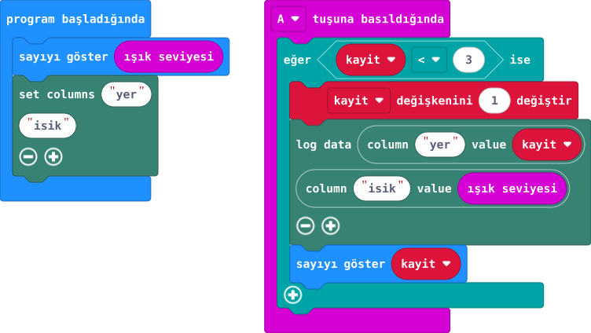

## 1. kısım — Ölçümünü sakla

Işığı yalnız ekranda görmeyecek, üç ölçümü kartın belleğine kaydedeceksin.

::kunye{sure="10" fikir="Veri kaydı" malzeme="micro:bit V2 + veri USB kablosu"}

### Önce tahmin et

:::tahmin
Aynı yerde iki ölçüm her zaman eşit mi?
:::

::yaz[Tahminim]{satir=1}

### Hazırla

1. MakeCode'da **Uzantılar → datalogger** bölümünü ekle. Bu özellik yalnız V2 ile çalışır.
2. Kod başlarken ışığı bir kez okuyup ekranda göster; bu hazırlık değeri günlüğe yazılmaz. **yer** ve **isik** sütunlarını tanımla.
3. Üç konum seç: **1 = karanlık** \_\_\_\_ / **2 = orta** \_\_\_\_ / **3 = aydınlık** \_\_\_\_. Sayıları seçtiğin gerçek yer adlarıyla eşleştir.

### Planla

::yaz[**Planım:** Ölçeceğim üç yer: \_\_\_\_ / \_\_\_\_ / \_\_\_\_.]{satir=2}

::yaz[**Neden?** Yer ve ışık değerini birlikte saklamak ne işe yarar?]{satir=2}

:::bilgi
Yeni program yüklemek önceki veri günlüğünü görünmez kılar. Ölçüm ve MY\_DATA adımları sonraki kısımdadır.
:::

## 2. kısım — Üç yerin ışık günlüğü

Üç ışık ölçümünü kaydet; MY\_DATA dosyasında yer ve ışık sütunlarını aç.

::kunye{sure="30" fikir="veri kaydı" malzeme="micro:bit V2 + veri USB kablosu"}

### Önce tahmin et

:::tahmin
Üç ölçüm bilgisayarda görünür mü?
:::

::yaz[Tahminim]{satir=1}

### Yap

1. Önceki kısımdaki 1, 2, 3 yer sırasını kullan. Açılıştaki ilk ışık sayısı hazırlık okumasıdır; 0 görünse bile günlüğe yazılmaz.
2. Kartı üç konuma sırayla götür; her konumda A'ya bir kez bas. **yer** sütununda sıra numarası, **isik** sütununda ölçüm bulunur.
3. Yeni kod yüklemeden MICROBIT içindeki MY\_DATA dosyasını aç ve üç satırı yer adlarınla eşleştir.

### Kartında dene

Tabloda üç satır görünmeli.

:::olmadiysa
Kartın V2 olduğunu, datalogger uzantısını ve A basışında kayıt bloğunu kontrol et.
:::

### Anlat

::yaz[**Gözlemim:** Üç değer: \_\_\_\_ / \_\_\_\_ / \_\_\_\_.]{satir=2}

::yaz[**Neden?** Kaydetmekle ekranda göstermek nasıl farklı?]{satir=2}

### Tek şeyi değiştir

Kayıt sınırını **3** yerine **4** yapıp kodu yeniden yükle. Üç yeri yeniden ölç, ardından en karanlık yeri bir kez daha ölç. Dördüncü satır oluştu mu?

::yaz[Ne değişti?]{satir=2}
