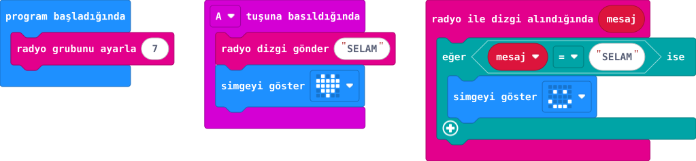

## Önce tahmin et

:::tahmin
Farklı gruptaki kart mesajı alır mı?
:::

::yaz[Tahminim]{satir=1}

## Yap

1. Öğretmenin verdiği aynı radyo grup numarasını iki kartta ayarla; örnekteki 7'yi kendi grup numaranla değiştir.
2. Aynı programı iki karta yükle. A'ya basınca SELAM gönder; gönderen kalp göstersin.
3. SELAM alan kart gülümseme göstersin; arkadaşınla rolleri değiştir.

## Kartında dene

Benim grubum: \_\_\_\_\_\
Arkadaşımın grubu: \_\_\_\_\_

İki kart sırayla gönderip almalı. Aynı gruptaki yakındaki başka kartlar da mesajı görebilir; kişisel bilgi gönderme.

:::olmadiysa
İki kartın grup numarasını ve yüklenen programı karşılaştır. Diğer çiftlerin farklı grupta olduğunu öğretmenle kontrol et.
:::

## Anlat

::yaz[**Gözlemim:** Gönderen \_\_\_\_; alan \_\_\_\_.]{satir=2}

::yaz[**Neden?** Grup numaraları niçin eşleşir?]{satir=2}

## Tek şeyi değiştir

Bir kartın grubunu değiştirip dene.

::yaz[Ne değişti?]{satir=2}
