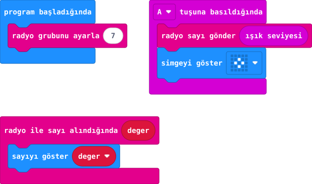

## Önce tahmin et

:::tahmin
Göndereni karartırsan gelen sayı değişir mi?
:::

::yaz[Tahminim]{satir=1}

## Yap

1. Öğretmenin atadığı aynı radyo grubunu iki kartta ayarla; örnekteki 7'yi değiştir.
2. Aynı programı iki karta yükle. Gönderici kartta A'ya basınca ışık düzeyini sayı olarak gönder.
3. Alıcı kartın ekranındaki sayıyı kaydet; gönderici kartı karartıp yeniden ölç. Sonra rolleri değiştir.

## Kartında dene

Benim grubum: \_\_\_\_\_\
Gönderici: \_\_\_\_\_ Alıcı: \_\_\_\_\_

Aydınlık ve karanlık okumaları farklı olmalı. Aynı gruptaki başka kartlar da sayıyı alabilir; kişisel bilgi gönderme.

:::olmadiysa
Grup numaralarını karşılaştır; ölçüm için gönderen kartın LED yüzünü aydınlatıp karart.
:::

## Anlat

::yaz[**Gözlemim:** Aydınlık \_\_\_\_; karanlık \_\_\_\_.]{satir=2}

::yaz[**Neden?** Hangi kart ölçüyor?]{satir=2}

## Tek şeyi değiştir

Gönderme olayındaki **A** düğmesini **B** yap; kodu iki karta da yükle. Artık hangi düğme sayı yollar?

::yaz[Ne değişti?]{satir=2}
