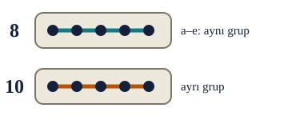
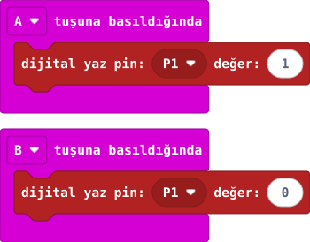

## 1. kısım — Dış devreye ilk adım

micro:bit V2 (setindeki sürüm: V2.2) genişletme kartını ve deney tahtasındaki beşli delik gruplarını tanı.

::kunye{sure="10" fikir="bağlı beşli grup" malzeme="micro:bit V2 + genişletme kartı + deney tahtası"}

### Önce tahmin et

:::tahmin
Aynı numaradaki a–e delikleri birbirine bağlı mı?
:::

::yaz[Tahminim]{satir=1}

### Parçaları bul

1. **USB ve pil bağlı değilken** micro:bit’i genişletme kartına öğretmeninle birlikte tak. Kartı zorlayıp eğme.
2. Öğretmenin doğruladığı şemayla genişletme kartında **P1** ve **GND** uçlarını bul. Uçları kablo rengine göre tahmin etme.
3. Deney tahtasında **a–e** tarafının 8, 10 ve 12 numaralı üç ayrı beşli grubunu bul. Her gruptaki beş delik kendi içinde bağlıdır.
4. 5 mm kırmızı LED’in **uzun (+)** ve **kısa (−)** bacağını göster. Üç **220 Ω** direnci öğretmeninle bul.

### Beşli grubu gör

:::bilgi
Ortadaki uzun yarık iki tarafı ayırır. a–e ile f–j, numara aynı olsa bile doğrudan bağlı değildir.
:::

### Anlat

::yaz[**Gözlemim:** P1 ve GND yazılarını \_\_\_\_\_\_ üzerinde buldum.]{satir=2}

::yaz[**Neden?** LED’in iki bacağı neden ayrı gruplara girmeli?]{satir=2}

### Hazırlık kontrolü

8, 10 ve 12 gruplarını çizim üzerinde farklı işaretlerle göster. Sonraki kısımda bu grupları bağlayacaksın.

::yaz[Notum]{satir=2}

## 2. kısım — LED yolunu kur

P1’den çıkan yol, seri bağlı üç 220 Ω direnç ve LED’den geçip GND’ye dönsün.

::kunye{sure="10" fikir="seri bağlantı" malzeme="kırmızı LED + 3 × 220 Ω (seri) + 2 jumper"}

### Önce tahmin et

:::tahmin
LED’in uzun bacağı GND tarafında olsaydı doğru yönde bağlanmış olur muydu?
:::

::yaz[Tahminim]{satir=1}

### USB ve pil çıkarılmışken bağla

1. Üç 220 Ω direnci farklı beşli gruplar arasında **uç uca seri** yerleştir: örneğin 8→9, 9→10 ve 10→11. Toplam direnç **660 Ω** olur.
2. LED’in **uzun (+)** bacağını son direncin bittiği **a–e 11**, **kısa (−)** bacağını **a–e 12** grubuna tak.
3. Doğrulanmış **P1** ucundan **a–e 8** grubuna bir jumper bağla.
4. Doğrulanmış **GND** ucundan **a–e 12** grubuna bir jumper bağla. 3V ucunu boş bırak.

 → GND. Şema ölçeksizdir.")

:::kontrol[Bağlantı kontrolü]
- Dirençler 8–9, 9–10 ve 10–11 arasında.
- LED + uç 11’de, − uç 12’de.
- P1 → 8, GND → 12.
- 3V boş.
:::

### Anlat

::yaz[**Gözlemim:** LED’in uzun bacağı \_\_\_, kısa bacağı \_\_\_ grubunda.]{satir=2}

::yaz[**Neden?** Direnci LED ile neden aynı yola koyduk?]{satir=2}

## 3. kısım — A yakar, B söndürür

A’ya basınca deney tahtasındaki kırmızı LED yansın; B’ye basınca sönsün.

::kunye{sure="10" fikir="pine 1 ve 0 yazma" malzeme="31. projenin LED devresi"}

### Önce tahmin et

:::tahmin
A’ya iki kez basarsan dış LED iki kez yanıp söner mi, yoksa yanık mı kalır?
:::

::yaz[Tahminim]{satir=1}

### Yap

1. Yeni projeye **“A tuşuna basıldığında”** ve **“B tuşuna basıldığında”** bloklarını ekle.
2. **Gelişmiş → Pinler** bölümünden **“dijital yaz pin: P1 değer: 1”** bloğunu A olayına koy.
3. Aynı bloğun **değerini 0** yapıp B olayına koy. **1** LED’i yakar; **0** söndürür.
4. Öğretmen devreyi kontrol ettikten sonra kodu karta aktar ve A/B ile dene.

### Kartında dene

Kırmızı LED’i izle. A’dan sonra yanık kalır mı? B’ye basınca ne olur?

::jest[Yak / söndür]{tuslar="A,B"}

:::olmadiysa
USB’yi çıkar; LED’in uzun/kısa bacağını, iki 220 Ω direnci ve P1/GND bağlantılarını öğretmeninle yeniden kontrol et.
:::

### Anlat

::yaz[**Gözlemim:** A’ya basınca \_\_\_\_\_\_; B’ye basınca \_\_\_\_\_\_.]{satir=2}

::yaz[**Neden?** P1’e yazılan **0** neyi değiştirdi?]{satir=2}

### Tek şeyi değiştir

A ve B olaylarındaki **1** ile **0** değerlerini yer değiştir. Düğmelerin görevi nasıl değişti?

::yaz[Ne değişti?]{satir=2}
