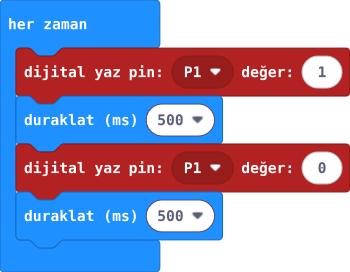

## Önce tahmin et

:::tahmin
LED 500 ms yanık ve 500 ms sönük kalırsa bir tam ritim kaç saniye sürer?
:::

::yaz[Tahminim]{satir=1}

## Yap

1. [31. projenin](proje:31) devresini **değiştirme**. Yeni bir MakeCode projesi aç.
2. **“her zaman”** içine **“dijital yaz pin: P1 değer: 1”** ve **“duraklat (ms) 500”** koy.
3. Altına **“dijital yaz pin: P1 değer: 0”** ve bir **“duraklat (ms) 500”** daha ekle.
4. Öğretmen bağlantıyı kontrol ettikten sonra kodu karta aktar. LED’in ritmini izle.

## Kartında dene

Kodu yükle. Düğmeye dokunmadan kırmızı LED’i 10 saniye izle.

::jest[Yan → sön]{tuslar="●"}

:::olmadiysa
Önceki projenin LED devresini enerjiyi keserek kontrol et. İki **“duraklat”** bloğunun da döngünün içinde olduğuna bak.
:::

## Anlat

::yaz[**Gözlemim:** LED 10 saniyede \_\_\_\_\_\_ kez yanıp söndü.]{satir=2}

::yaz[**Neden?** İkinci 500 ms bekleme olmasa neyi zor görürdün?]{satir=2}

## Tek şeyi değiştir

Ritmin bekleme değerini iki blokta da **500** yerine **200 ms** yap. Daha hızlı mı?

::yaz[Ne değişti?]{satir=2}
