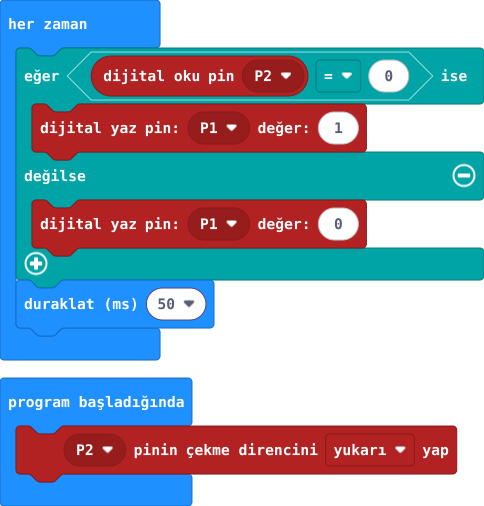

## 1. kısım — Yeni düğmeyi bağla

Kartın A ve B düğmeleri dışında bir düğme daha kullan. LED devresi yerinde kalsın.

::kunye{sure="10" fikir="Giriş pini" malzeme="31. projenin LED devresi + buton + 2 jumper"}

### Önce tahmin et

:::tahmin
Butona basınca P2 ile GND arasında bir yol açılır mı, kapanır mı?
:::

::yaz[Tahminim]{satir=1}

### USB ve pil çıkarılmışken bağla

1. [31. projedeki](proje:31) **P1 → üç seri 220 Ω → LED → GND** bağlantısını koru. Öğretmenin butonun karşılıklı iki tarafını kontrol etsin. Enerji yokken çoklu ölçerin süreklilik ayarıyla seçilen iki uç arasında basmadan bağlantı olmadığını, basınca bağlantı olduğunu doğrulasın.
2. Dört ayaklı butonu deney tahtasının **orta yarığını aşacak** biçimde yerleştir. İki ayağı yarığın bir yanında, iki ayağı öbür yanında olsun.
3. Doğrulanmış **P2** ucunu butonun bir yanındaki ayakla **aynı beşli gruba** bağla.
4. **GND** ucunu butonun öbür yanındaki ayakla **aynı beşli gruba** bağla. 3V ucunu boş bırak.

:::kontrol[Bağlantı kontrolü]
- Buton yarığı aşıyor.
- P2 ve GND basınca birleşen karşı uçlarda.
- P1 LED yolu duruyor.
- 3V boş.
:::

### Anlat

::yaz[**Gözlemim:** Butonun bir yanı \_\_\_\_\_\_, öbür yanı \_\_\_\_\_\_ pinine gidiyor.]{satir=2}

::yaz[**Neden?** P2 ile GND basmadan birleşseydi LED nasıl davranırdı?]{satir=2}

## 2. kısım — Basınca yansın

Dış düğmeye basılı tutunca LED yansın; bırakınca sönsün.

::kunye{sure="15" fikir="Girişe göre karar" malzeme="P1 LED + P2 buton devresi (33. proje)"}

### Önce tahmin et

:::tahmin
Düğmeye basılıyken P2 hangi değeri okur: 0 mı, 1 mi?
:::

::yaz[Tahminim]{satir=1}

### Kodla ve dene

1. Yeni MakeCode projesinde **“program başladığında”** bölümüne **“P2 pinin çekme direncini yukarı yap”** bloğunu koy.
2. **“her zaman”** içine **“eğer dijital oku pin P2 = 0 ise”** koşulunu ekle.
3. **“ise”** bölümünde P1’e **1**, **“değilse”** bölümünde P1’e **0** yaz. Sonuna **50 ms duraklat** ekle.
4. Öğretmen devreyi kontrol ettikten sonra kodu karta aktar. Butona basıp bırakırken LED’i izle.

### Kartında dene

**Çekme direnci:** Buton bırakıldığında P2’yi 1’de tutan iç ayardır. Basınca P2, GND’ye bağlanır ve 0 okunur.

Dış düğmeye üç kez basıp bırak. LED yalnız basılıyken yanıyor mu?

::jest[Bas → yan]{tuslar="●"}

:::olmadiysa
USB’yi çıkar. Butonun orta yarığı aştığını, P2/GND’nin karşı yanlarda olduğunu ve LED’in P1 bağlantısını öğretmeninle kontrol et.
:::

### Anlat

::yaz[**Gözlemim:** Basılıyken LED \_\_\_\_\_\_; bırakınca \_\_\_\_\_\_.]{satir=2}

::yaz[**Neden?** Bu kodda P2 değeri 0 olduğunda P1’e neden 1 yazdık?]{satir=2}

### Tek şeyi değiştir

“ise” ve “değilse” içindeki P1 değerlerini yer değiştir. LED’in davranışı nasıl değişti?

::yaz[Ne değişti?]{satir=2}
