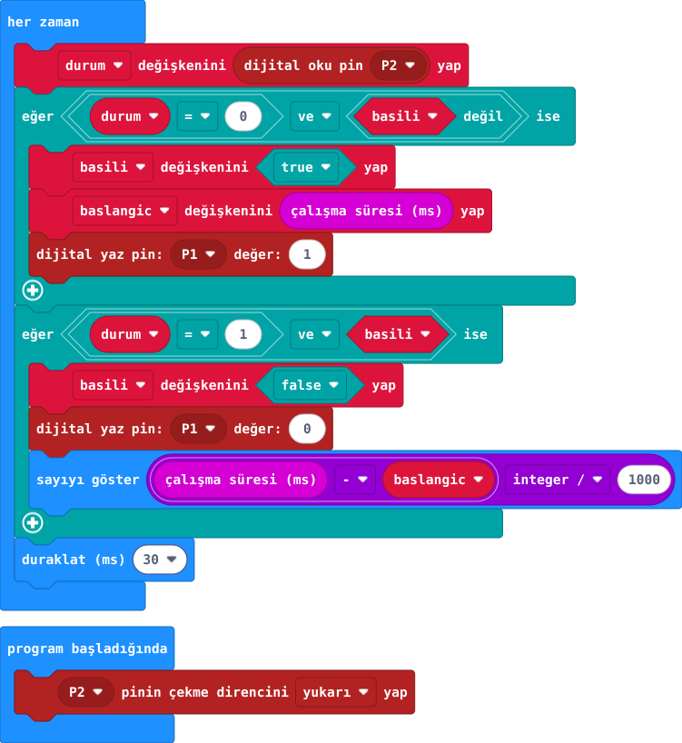

## Önce tahmin et

:::tahmin
Uzun basışta sayı büyür mü?
:::

::yaz[Tahminim]{satir=1}

## Yap

1. USB/pili çıkar; [33. projenin](proje:33) P2 buton ve dirençli P1 LED yollarını kur.
2. P2 iç yukarı çekmesini aç; basınca zamanı kaydet ve LED'i yak.
3. Bırakınca LED'i söndür ve geçen saniyeyi göster.

## Kartında dene

Bir ve üç saniyelik basışları karşılaştır.

:::olmadiysa
USB/pili çıkar; düğmenin P2–GND yolunu öğretmeninle kontrol et. Başlangıç ve bırakma geçişlerini karşılaştır.
:::

## Anlat

::yaz[**Gözlemim:** Kısa \_\_\_\_ sn; uzun \_\_\_\_ sn.]{satir=2}

::yaz[**Neden?** Serbest=1, basılı=0 ne demek?]{satir=2}

## Tek şeyi değiştir

Saniyeye çevirirken kullanılan böleni 1000 yerine 100 yap. Gösterilen sayı nasıl değişti?

::yaz[Ne değişti?]{satir=2}
