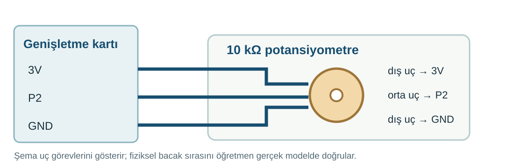

## 1. kısım — Ayar düğmesini bağla

Potansiyometreyi çevirerek P2’ye giden değeri değiştireceksin.

::kunye{sure="10" fikir="Üç uçlu ayar" malzeme="10 kΩ potansiyometre + 3 jumper"}

### Önce tahmin et

:::tahmin
Ortadaki uçtan okunan değer, düğmeyi çevirince aynı kalır mı?
:::

::yaz[Tahminim]{satir=1}

### USB ve pil çıkarılmışken bağla

1. [33. projenin](proje:33) **P2 butonunu çıkar**. P1 LED devresi kalabilir. Potansiyometrenin üç ucunu öğretmeninle belirle; bağlantı kabloları sağlam ve yalıtılmış olmalı.
2. Öğretmenin genişletme kartındaki **3V** ve **GND** uçlarını ürün şemasıyla doğrulasın; 3V ucunu ölçsün. P2 girişine 5 V bağlanmaz.
3. **USB ve pil çıkarılmışken** potansiyometrenin bir dış ucunu doğrulanmış **3V**, orta ucunu **P2** ucuna bağla.
4. Öbür dış ucu **GND** ucuna bağla. Üç kablonun birbirine değmediğini öğretmeninle kontrol et.

:::kontrol[Bağlantı kontrolü]
- Buton P2’den çıkarıldı.
- Güç 3,3 V olarak doğrulandı.
- Orta uç P2’de.
- Kablolar yalıtıldı.
:::

### Anlat

::yaz[**Gözlemim:** Ortadaki uç \_\_\_\_\_\_ pinine bağlı.]{satir=2}

::yaz[**Neden?** Orta uç neden güç ucuna değil, P2’ye gider?]{satir=2}

## 2. kısım — Çevir, A’ya bas, oku

Düğmeyi farklı konumlara çevir. A’ya her basışında P2’deki sayıyı gör.

::kunye{sure="15" fikir="Analog okuma" malzeme="35. projenin potansiyometre devresi"}

### Önce tahmin et

:::tahmin
Düğmeyi çevirdikten sonra A’ya basarsan aynı sayı mı çıkar?
:::

::yaz[Tahminim]{satir=1}

### Kodla ve dene

1. Yeni MakeCode projesinde **“A tuşuna basıldığında”** bloğunu ekle.
2. İçine **“sayıyı göster”** bloğunu koy. **Gelişmiş → Pinler** bölümündeki **“analog oku pin”** bloğunu sayı alanına yerleştir ve pini **P2** seç.
3. Öğretmen devreyi kontrol ettikten sonra kodu yükle. Düğmeyi üç farklı konuma çevir; her konumda A’ya bas.
4. Gördüğün sayıları sırayla kaydet. Okuma **0 ile 1023 arasında** olabilir; dönüş yönünü sayılardan keşfet.

### Kartında dene

Üç farklı konum seç. A’ya bastığında değerleri karşılaştır.

::yaz[1. okuma]{satir=1}

::yaz[2. okuma]{satir=1}

::yaz[3. okuma]{satir=1}

:::olmadiysa
USB’yi çıkar. Öğretmenin orta ucun P2’ye, dış uçların 3,3 V ve GND’ye bağlı olduğunu kontrol etsin.
:::

### Anlat

::yaz[**Gözlemim:** En küçük sayı \_\_\_\_\_\_; en büyük sayı \_\_\_\_\_\_.]{satir=2}

::yaz[**Neden?** Bu projede P2 neden yalnız 0 veya 1 okumuyor?]{satir=2}

### Tek şeyi değiştir

Düğmeyi iki uç konumda dene. Okumaların hangisi 0’a, hangisi 1023’e daha yakın?

::yaz[Ne değişti?]{satir=2}
