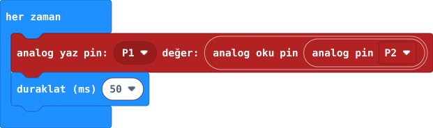

## Önce tahmin et

:::tahmin
P1’e 0 ve 1023 dışında bir değer yazarsan LED nasıl görünür?
:::

::yaz[Tahminim]{satir=1}

## Yap

1. [35. projenin](proje:35) **P2 potansiyometre** bağlantısını koru. [31. projedeki](proje:31) **P1 → 3 × 220 Ω → LED → GND** yolunu öğretmeninle yeniden kontrol et.
2. Yeni projede **“her zaman”** içine **Gelişmiş → Pinler** bölümündeki **“analog yaz pin”** bloğunu koy; pini **P1** seç.
3. Değer alanına **“analog oku pin”** bloğunu yerleştir ve pini **P2** seç. Altına **“duraklat (ms) 50”** ekle.
4. Öğretmen bağlantıyı kontrol ettikten sonra kodu yükle. Düğmeyi yavaşça çevirip LED’i izle.

## Kartında dene

LED’i en sönük ve en parlak gördüğün iki konumu bul.

::jest[Sönük → parlak]{tuslar="◐"}

:::olmadiysa
USB’yi çıkar. Öğretmenin üç 220 Ω direnci, LED yönünü, P1 yolunu ve potansiyometrenin P2 bağlantısını kontrol etsin.
:::

## Anlat

::yaz[**Gözlemim:** Düğmeyi çevirince LED \_\_\_\_\_\_.]{satir=2}

::yaz[**Neden?** [31. projedeki](proje:31) 0/1 komutundan burada ne farklı?]{satir=2}

## Tek şeyi değiştir

“Analog oku” bloğunu geçici çıkarıp P1’e **500** yaz. LED’i iki uç konumla karşılaştır; sonra bloğu geri koy.

::yaz[Ne değişti?]{satir=2}
