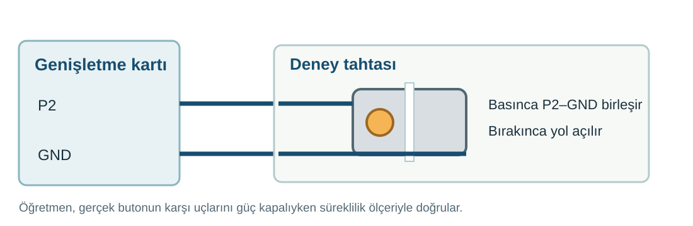
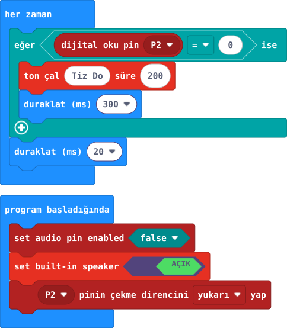

## 1. kısım — Butonla zili hazırla

Dış buton, micro:bit V2 kartının kendi hoparlöründe zil sesi başlatacak.

::kunye{sure="10" fikir="kart hoparlörü ve dış düğme" malzeme="P2 buton devresi + micro:bit V2 hoparlörü"}

### Önce tahmin et

:::tahmin
Butona basmadan hoparlörden ses çıkar mı?
:::

::yaz[Tahminim]{satir=1}

### Yap

1. P2 ile GND arasındaki [33. proje](proje:33) buton devresini yeniden kur.
2. Ses kablosu takma: ses micro:bit V2’nin kendi hoparlöründen gelir. P0’a başka parça bağlama.
3. Öğretmenin P2 ve GND pinlerini doğrulasın; sonra kartın gücünü aç.

:::bilgi
Ses, micro:bit V2 üzerindeki hoparlörden gelir. Başka bir ses parçası bağlaman gerekmez.
:::

### Anlat

::yaz[**Gözlemim:** Buton serbestken P2 \_\_\_, basılıyken \_\_\_.]{satir=2}

::yaz[**Neden?** Hoparlör için neden ayrı bir çıkış kablosu gerekmedi?]{satir=2}

### Kartında dene

Sonraki kısmın kodunu yükleyince butona iki kez kısa bas; arada bırak. Kaç ses duydun?

::yaz[Notum]{satir=2}

## 2. kısım — Zili kodla

Butona bastığında kart hoparlörü kısa bir ses çalsın.

::kunye{sure="15" fikir="düğmeye bağlı ses" malzeme="P2 buton devresi + micro:bit V2 hoparlörü"}

### Önce tahmin et

:::tahmin
Butonu uzun süre basılı tutarsan ses tekrarlar mı?
:::

::yaz[Tahminim]{satir=1}

### Yap

1. Başlangıçta “set audio pin enabled” = false (dış ses pini kapalı), “set built-in speaker” = AÇIK yap. P2'nin iç yukarı çekmesini aç.
2. Her zaman döngüsünde P2'yi oku. Değer 0 ise 523 Hz sesi 200 ms çal, ardından 300 ms bekle.
3. Kodu yükle; iki kısa basışı ve bir uzun basışı karşılaştır.

### Anlat

::yaz[**Gözlemim:** Kısa basışta \_\_\_ ses duydum.]{satir=2}

::yaz[**Neden?** P2=0 neden basıldı anlamına geliyor?]{satir=2}

### Tek şeyi değiştir

300 ms beklemeyi 600 ms yapıp tekrar dene.

::yaz[Ne değişti?]{satir=2}
