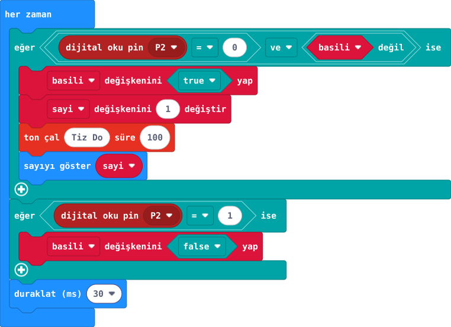
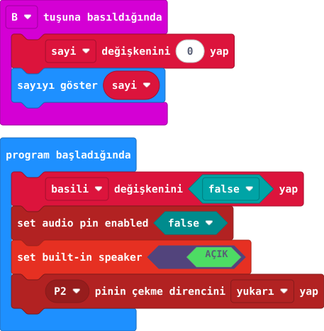

## Önce tahmin et

:::tahmin
Üç saniye basılı tutmak bir mi, birçok mu ziyaret saymalı?
:::

::yaz[Tahminim]{satir=1}

## Yap

1. [37. projenin](proje:37) P2–GND butonunu kullan; harici buzzer bağlama.
2. Sayıyı 0 ve basılı bilgisini yanlış başlat. P2 ilk kez 0 olunca sayıyı artır, sesi çal, basılı bilgisini doğru yap.
3. P2 yeniden 1 olunca basılı bilgisini yanlış yap. B ile sayıyı sıfırla.

:::galeri

:::

## Anlat

::yaz[**Gözlemim:** Üç ayrı basışta sayı \_\_\_ oldu.]{satir=2}

::yaz[**Neden?** Basılı bilgisini tutmasaydık ne olurdu?]{satir=2}

## Tek şeyi değiştir

“Tiz Do” sesini “Orta Do” yap. Ziyaret sesi nasıl değişti?

::yaz[Ne değişti?]{satir=2}
