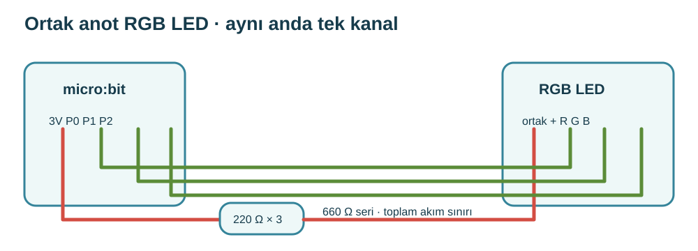
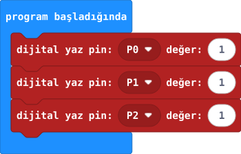
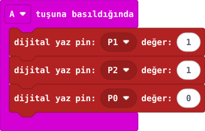
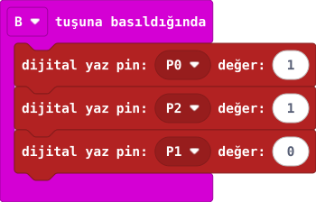
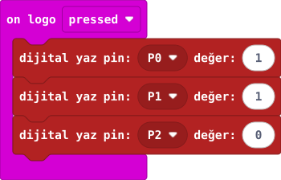

## 1. kısım — RGB LED'i tanı

RGB LED'in R, G ve B kanalları tek gövdede bulunur.

::kunye{sure="10" fikir="ortak anotlu RGB LED" malzeme="RGB LED (ortak anot) + 3 × 220 Ω (seri) + 4 jumper"}

### Önce tahmin et

:::tahmin
Tek gövdeden kaç temel renk seçebiliriz?
:::

::yaz[Tahminim]{satir=1}

### Yap

1. Öğretmenin gerçek LED veri sayfasından ortak anot (+) ve R/G/B bacaklarını etiketlesin. Uzun bacak tahminiyle bağlama.
2. Dört bacağın deney tahtasında birbirinden ayrı gruplara gireceği konumu işaretle.
3. A, B ve logo girişlerini sırasıyla kırmızı, yeşil ve maviyle eşleştir.

:::bilgi
Bu etkinlikte ortak anotlu RGB LED kullanılır ve yalnız bir renk kanalı açık tutulur. Model değişirse bacak sırası ve ortak uç öğretmen tarafından doğrulanır. Ortak yoldaki üç seri 220 Ω toplam 660 Ω'dur; renkler görece sönük olabilir.
:::

### Bacak etiketlerini kaydet

::yaz[**Ortak anot (+)** · Gideceği yol: 3V → üç seri 220 Ω — Gerçek bacak / etiket]{satir=1}

::yaz[**R · kırmızı** · Gideceği yol: P0 — Gerçek bacak / etiket]{satir=1}

::yaz[**G · yeşil** · Gideceği yol: P1 — Gerçek bacak / etiket]{satir=1}

::yaz[**B · mavi** · Gideceği yol: P2 — Gerçek bacak / etiket]{satir=1}

### Anlat

::yaz[**Gözlemim:** Ortak bacak \_\_\_ olarak etiketlendi.]{satir=2}

::yaz[**Neden?** Her renk için neden ayrı kontrol pini var?]{satir=2}

### Tahmin et

R ve B kanallarının pin eşlemesini değiştirdiğini düşün. A hangi rengi seçerdi?

::yaz[Notum]{satir=2}

## 2. kısım — RGB yolunu kur

Ortak anot yoluna üç seri 220 Ω koyarak toplam akımı sınırla.

::kunye{sure="15" fikir="ortak yola seri direnç" malzeme="RGB LED + 3 × 220 Ω (seri) + P0, P1, P2"}

### Önce tahmin et

:::tahmin
Dirençleri ortak yola koyunca aynı anda iki renk açabilir miyiz?
:::

::yaz[Tahminim]{satir=1}

### Yap

1. USB ve pili çıkar. Ortak anot bacağını doğrulanmış 3V ucuna üç seri 220 Ω üzerinden bağla.
2. R → P0, G → P1, B → P2 bağla. R/G/B bacaklarının birbirine kısa devre olmadığını kontrol et.
3. Öğretmen 3V ve GND yollarını denetlesin. Kodda her an yalnız bir kanalı 0, ötekileri 1 tut.

:::bilgi
Bu etkinlikte ortak anotlu RGB LED kullanılır ve yalnız bir renk kanalı açık tutulur. Model değişirse bacak sırası ve ortak uç öğretmen tarafından doğrulanır. Ortak yoldaki üç seri 220 Ω toplam 660 Ω'dur; renkler görece sönük olabilir.
:::

### Anlat

::yaz[**Gözlemim:** Ortak yoldaki direnç toplamı \_\_\_ Ω.]{satir=2}

::yaz[**Neden?** Bu kurulumda iki rengi aynı anda açmak neden uygun değil?]{satir=2}

### Hesapla ve düşün

Direnci değiştirmeden düşün: 660 Ω yerine 440 Ω olsaydı akım artar mıydı?

::yaz[Notum]{satir=2}

## 3. kısım — Rengi seç

A kırmızı, B yeşil, logoya dokunma (Touched) mavi kanalı seçsin.

::kunye{sure="15" fikir="ortak anotta 0 yazınca yanar" malzeme="RGB devresi (39. proje)"}

### Önce tahmin et

:::tahmin
Ortak anotlu LED'de seçili pine 0 yazınca ne olur?
:::

::yaz[Tahminim]{satir=1}

### Yap

1. Başlangıçta P0, P1 ve P2'ye 1 yaz; renkleri kapat.
2. A olayında yalnız P0'a 0; B olayında yalnız P1'e 0; logo olayında yalnız P2'ye 0 yaz.
3. Her seçimden önce diğer iki pini 1 yap; üç rengi tek tek dene.

:::galeri

:::

### Anlat

::yaz[**Gözlemim:** A \_\_\_, B \_\_\_, logo \_\_\_ rengini seçti.]{satir=2}

::yaz[**Neden?** Birden fazla pin 0 olursa gözlem neden değişir?]{satir=2}

### Tek şeyi değiştir

A olayında P0’a 0 yerine 1 yaz; diğer komutlar aynı kalsın. A’ya basınca ne olur?

::yaz[Ne değişti?]{satir=2}
