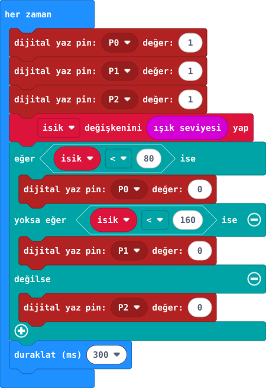

## Önce tahmin et

:::tahmin
Karanlıkta hangi kanal yanacak?
:::

::yaz[Tahminim]{satir=1}

## Yap

1. [39. projenin](proje:39) ortak 660 Ω yolunu koru. P0/P1/P2 çıkışlarını önce 1 yap.
2. Işık 80'in altındaysa P0, 80–159 arasındaysa P1, 160 ve üstündeyse P2'yi 0 yap.
3. Her döngüde önce üç kanalı söndür; sonra yalnız birini seç. Karanlık, orta ve aydınlıkta dene.

:::bilgi
Bu etkinlikte ortak anotlu RGB LED kullanılır ve yalnız bir renk kanalı açık tutulur. Model değişirse bacak sırası ve ortak uç öğretmen tarafından doğrulanır. Ortak yoldaki üç seri 220 Ω toplam 660 Ω'dur; renkler görece sönük olabilir.
:::

## Anlat

::yaz[**Gözlemim:** Karanlıkta \_\_\_, aydınlıkta \_\_\_ kanalını gördüm.]{satir=2}

::yaz[**Neden?** Önce tüm kanalları söndürmek neyi önlüyor?]{satir=2}

## Tek şeyi değiştir

80 eşiğini 100 yap ve değişen aralığı gözle.

::yaz[Ne değişti?]{satir=2}
