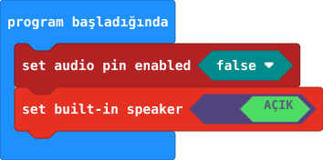
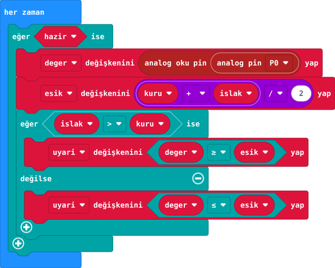
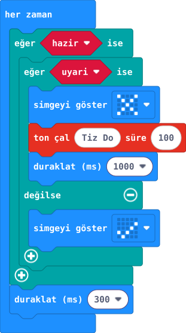

## Önce tahmin et

:::tahmin
Eşiği kuru değere eşit seçersek ne olur?
:::

::yaz[Tahminim]{satir=1}

## Yap

1. Proje şablonunu aç. Karar ve sonuç görselleri aynı “her zaman” döngüsünün parçalarıdır.
2. Önce kuru sensörde A'ya, ardından ıslak sensörde B'ye bas. Kod iki örneğin ortasını eşik olarak seçer.
3. Kod P0 değerini okur ve örneklerden karşılaştırma yönünü seçer. Islakken uyarı, kuruyken onay göster.
4. Uyarıda kart hoparlöründe kısa ton çal. Bu, kısa sınıf deneyidir; sensörü sürekli açık bırakma.

**Başlangıç ayarı:** Dış ses pinini kapat, kart hoparlörünü aç. Sensör P0’dadır.\
Önce A, sonra B: örnekler en az 30 sayı ayrılmalı; değilse yeniden ölç.

:::galeri

:::

## Anlat

::yaz[**Gözlemim:** Kuru \_\_\_, ıslak \_\_\_, eşik \_\_\_.]{satir=2}

::yaz[**Neden?** Eşik gerçek ölçüm olmadan neden seçilemez?]{satir=2}

## Tek şeyi değiştir

Kuru örnek aynı kalsın; yalnız ıslak örneği farklı ıslaklıkta yeniden al. Uyarı ne zaman başlar?

::yaz[Ne değişti?]{satir=2}
