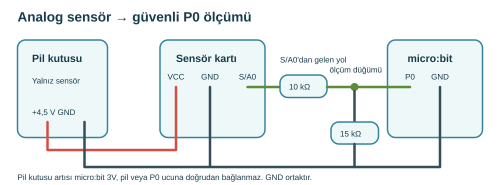

## 1. kısım — Toprak nemi probunu tanı

FC-28 türü analog problu modül toprakla temas edince okuma değiştirir.

::kunye{sure="10" fikir="dirençli toprak probu" malzeme="toprak sensörü (FC-28 türü) + pil kutusu"}

### Önce tahmin et

:::tahmin
Kuru ve nemli toprakta sayı aynı çıkar mı?
:::

::yaz[Tahminim]{satir=1}

### Yap

1. Öğretmen modülün gerçekten A0 analog çıkışlı FC-28 türü olduğunu ve 3–5 V ile çalıştığını ürün etiketiyle doğrulasın.
2. Bu devre analog A0 çıkışını okur. Röle kontaklarını veya D0 ucunu P0 ölçüm yoluna bağlama.
3. Yalnız metal prob toprağa girsin. Karşılaştırıcı kart, deney tahtası ve micro:bit kuru kalsın.

:::bilgi
Bu etkinlikte pompa yoktur; sonuç bir ölçüm ve uyarıdır. Öğretmen sensör modelini ve pinlerini doğrulamalı.
:::

### Anlat

::yaz[**Gözlemim:** Aynı toprakta nem artınca elektriksel iletim \_\_\_ değişti.]{satir=2}

::yaz[**Neden?** Röle çıkışlı modül neden A0 ölçümüne eşdeğer değil?]{satir=2}

### Tahmin et

Aynı toprakta prob daha derine girerse okuma nasıl değişir? Sonraki kısımda öğretmeninle dene.

::yaz[Notum]{satir=2}

## 2. kısım — Toprağı karşılaştır

FC-28 türü modülün analog değerini güvenli P0 yolundan oku.

::kunye{sure="15" fikir="iki ortamı karşılaştırma" malzeme="toprak sensörü + pil kutusu + 10 kΩ + 15 kΩ + jumper"}

### Önce tahmin et

:::tahmin
Nemli toprak her modülde daha büyük sayı verir mi?
:::

::yaz[Tahminim]{satir=1}

### Yap

1. USB ve pil çıkarılmışken kur. Öğretmenin ürünün VCC, GND, A0 yazılarını ve sensör pil kutusunun kutuplarını doğrulasın.
2. Pil kutusunun artı ucu → modül VCC; eksi ucu → modül GND. Probu kendi iki uçlu soketine tak.
3. Sensörün analog çıkışı (S/A0) → 10 kΩ → ölçüm düğümü → 15 kΩ → ortak GND bağla; yalnız ölçüm düğümünü micro:bit P0 girişine götür. Sensör pil kutusu micro:bit'in 3V veya pil girişine gitmez.
4. Sensör GND, pil kutusunun eksi ucu ve micro:bit GND ortak olsun. Öğretmen micro:bit P0 kablosu ayrıyken sensör pil kutusunu açıp ölçüm düğümünü ölçsün: en çok 3,0 V olmalı. Sonra gücü kapatıp P0'u bağlasın; micro:bit'i USB ile çalıştır.
5. Kuru ve nemli toprağı A ile üçer kez oku. Bitince sensör pil kutusunu kapat, probu çıkar; sürekli besleme korozyonu hızlandırabilir.

### Anlat

::yaz[**Gözlemim:** Kuru \_\_\_, nemli \_\_\_.]{satir=2}

::yaz[**Neden?** Sabit eşik yerine kendi ölçümümüzü niçin kullandık?]{satir=2}

### Tek şeyi değiştir

Öğretmeninle gücü kapatıp aynı toprakta yalnız prob derinliğini değiştir. Yeniden açıp oku; kart kuru kalsın.

::yaz[Ne değişti?]{satir=2}
