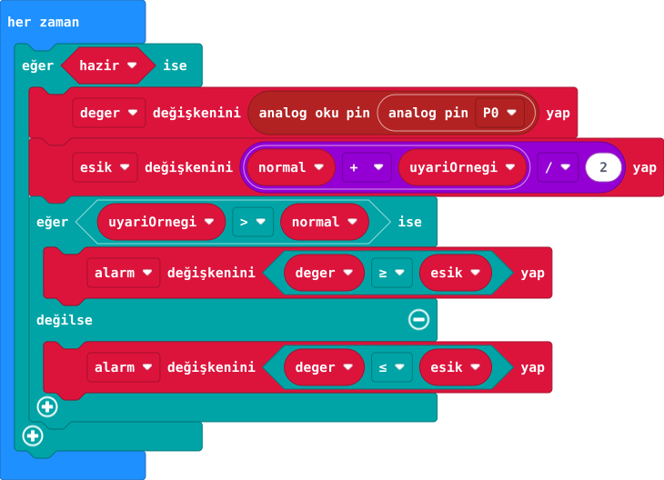
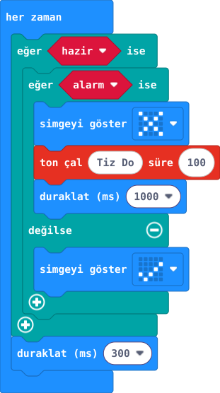

## 1. kısım — Çevre nöbetçini seç

Bir çevre sensörü seçip ölçüm, karar ve uyarıdan oluşan mini sistem tasarla.

::kunye{sure="10" fikir="kendi sensör yolunu seçme" malzeme="seçtiğin sensör (su / yağmur / toprak); bir seferde biri"}

### Önce tahmin et

:::tahmin
Hangi durumda uyarı vermek faydalı?
:::

::yaz[Tahminim]{satir=1}

### Yap

1. [41. proje](proje:41) su seviyesi, [43. proje](proje:43) yağmur veya [44. proje](proje:44) toprak nemi yollarından birini seç.
2. Seçtiğin sensörün pil kutusu ve 10 kΩ/15 kΩ bölücü bağlantısını çiz.
3. Bir giriş (P0 okuması), kendi eşik kuralın ve çıkış (ekran veya kart hoparlörü) yaz.

### Anlat

::yaz[**Gözlemim:** Seçimim \_\_\_; girişim \_\_\_.]{satir=2}

::yaz[**Neden?** Aynı eşik neden her sensöre uymaz?]{satir=2}

### Planla

Başarı ölçütünü bir cümleyle yaz.

::yaz[Notum]{satir=2}

## 2. kısım — Ölç ve planla

Kuru ve ıslak iki durumu ölçerek uyarı eşiği seç.

::kunye{sure="15" fikir="iki durumdan eşik" malzeme="seçtiğin sensörün devresi (41, 43 veya 44. proje)"}

### Önce tahmin et

:::tahmin
Eşik iki duruma ne kadar yakın olmalı?
:::

::yaz[Tahminim]{satir=1}

### Yap

1. Öğretmen enerji yokken bağlantıyı denetlesin; yalnız seçtiğin bir sensörü P0'a bağla.
2. İki durumun her birinde üç P0 okuması al; tabloya kaydet.
3. Uyarı yönünü (\< veya \>) ve iki küme arasında bir eşik öner. Kod A/B örneklerinin ortasını kullanır; kümeler örtüşüyorsa örnekleri yinele.

:::kontrol[Örnekleri sırayla al]
- A: normal durum → normal değişkeni. B: uyarı durumu → uyariOrnegi değişkeni. Eşik: (normal + uyariOrnegi) ÷ 2. Hazır şablon bu sırayı ve iki örneğin ayrılmasını kontrol eder.
:::

### İki durumu üç kez ölç

::yaz[**Normal** — 1. ölçüm / 2. ölçüm / 3. ölçüm]{satir=2}

::yaz[**Uyarı** — 1. ölçüm / 2. ölçüm / 3. ölçüm]{satir=2}

### Anlat

::yaz[**Gözlemim:** Durum A \_\_\_; durum B \_\_\_; eşik \_\_\_.]{satir=2}

::yaz[**Neden?** İki küme örtüşürse güvenilir karar verebilir miyiz?]{satir=2}

### Tek şeyi değiştir

Üçer okumayı farklı zamanda tekrarla.

::yaz[Ne değişti?]{satir=2}

## 3. kısım — Nöbetçiyi kodla

Seçtiğin eşiğe göre kart ekranında kararını göster.

::kunye{sure="20" fikir="eşiğe göre uyarı" malzeme="sensör devresi + V2 ekranı/hoparlörü"}

### Önce tahmin et

:::tahmin
Ölçüm eşik çevresinde gidip gelirse ne görürüz?
:::

::yaz[Tahminim]{satir=1}

### Yap

1. Proje şablonunu aç. Karar ve sonuç görselleri aynı “her zaman” döngüsünün parçalarıdır.
2. Normal durumda A, uyarı durumunda B ile P0 örneğini al. Kod ortalamayı eşik yapar.
3. Uyarıda çarpı ve kısa kart içi ton; normal durumda onay göster.
4. İki fiziksel durumda ayrı ayrı dene. Yanlış uyarı varsa örnekleri yeniden al; kod eşiği yeniden hesaplar.

**Başlangıç ayarı:** Dış ses pinini kapat, kart hoparlörünü aç. Sensör P0’dadır.\
Önce A, sonra B: örnekler en az 30 sayı ayrılmalı; değilse yeniden ölç.

:::galeri

:::

:::bilgi
Sistem yalnız haber verir; sulama yapmaz. Deney bitince sensör kaynağını kapat.
:::

### Anlat

::yaz[**Gözlemim:** Üç denemenin \_\_\_ tanesi doğruydu.]{satir=2}

::yaz[**Neden?** B örneğini değiştirmek uyarıyı nasıl etkiledi?]{satir=2}

### Tek şeyi değiştir

Normal örnek aynı kalsın; yalnız uyarı örneğini yeniden al. Yanlış uyarı sayısı değişti mi?

::yaz[Ne değişti?]{satir=2}

## 4. kısım — Nöbetçini anlat

Devreni, ölçümünü ve uyarı kararını bir arkadaşına göster.

::kunye{sure="10" fikir="sistemi anlatma ve test etme" malzeme="tamamlanan çevre nöbetçisi"}

### Önce tahmin et

:::tahmin
Arkadaşın sistemi sen anlatmadan kullanabilir mi?
:::

::yaz[Tahminim]{satir=1}

### Yap

1. Seçtiğin sensörün adını, P0 yolunu ve ortak GND'yi şema üzerinde göster.
2. Normal/uyarı değerlerini, eşik sayını ve karşılaştırma yönünü söyle.
3. Üç denemenin sonucunu kaydet; en az ikisi beklediğin uyarıyı veriyor mu kontrol et.

### Üç denememi göster

::yaz[**Deneme 1** — Gerçek durum / Beklenen sonuç / Gördüğüm sonuç]{satir=2}

::yaz[**Deneme 2** — Gerçek durum / Beklenen sonuç / Gördüğüm sonuç]{satir=2}

::yaz[**Deneme 3** — Gerçek durum / Beklenen sonuç / Gördüğüm sonuç]{satir=2}

### Anlat

::yaz[**Gözlemim:** Başarılı deneme \_\_\_ / 3.]{satir=2}

::yaz[**Neden?** Sistem hangi durumda yanlış karar verebilir?]{satir=2}

### Sonraki adım

Bir sonraki sürüm için tek bir iyileştirme yaz.

::yaz[Notum]{satir=2}
